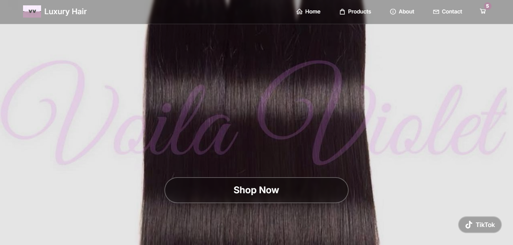
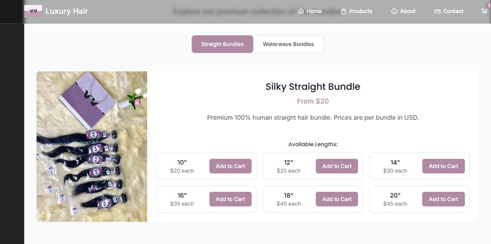
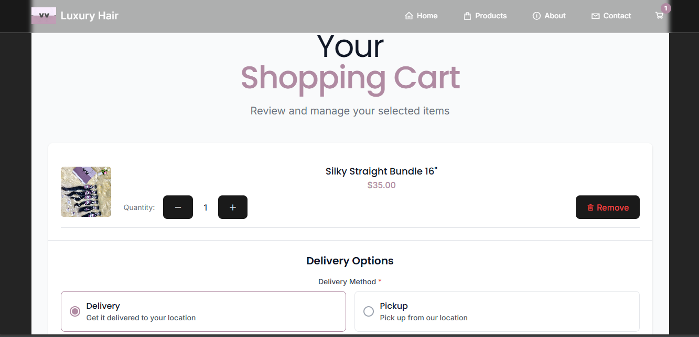

# Voila Violet - Hair Extensions E-commerce

A modern, responsive e-commerce website for Voila Violet, specializing in high-quality hair extensions. Built with React, Vite, and Tailwind CSS.

## 🚀 Features

- Browse different types of hair extensions (Straight, Waterwave)
- Product catalog with images and descriptions
- Shopping cart functionality
- Responsive design for all devices
- Smooth animations and transitions

## 🛠️ Tech Stack

- ⚛️ React 19
- ⚡ Vite
- 🎨 Tailwind CSS
- 🔄 React Router
- 🛒 Context API for state management

## 🚀 Getting Started

### Prerequisites
- Node.js (v16 or later)
- npm or yarn

### Installation

1. Clone the repository
   ```bash
   git clone https://github.com/YOUR-USERNAME/voilaviolet.git
   cd voilaviolet
   ```

2. Install dependencies
   ```bash
   npm install
   # or
   yarn
   ```

3. Start the development server
   ```bash
   npm run dev
   # or
   yarn dev
   ```
   Open [http://localhost:5173](http://localhost:5173) to view it in your browser.

## 📱 Screenshots

### Home Page


### Products Page


### Cart Page


### About Us Page


### Contact Us Page


## 🏗️ Building for Production

```bash
npm run build
# or
yarn build
```

## 🌐 Deployment

This project can be easily deployed to:
- [Vercel](https://vercel.com/)
- [Netlify](https://www.netlify.com/)
- [GitHub Pages](https://pages.github.com/)

## 📝 License

This project is licensed under the MIT License.

